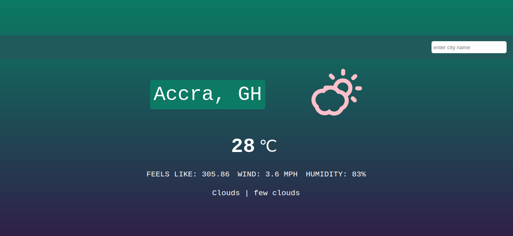

# Odin: Weather App Project

## Screenshot

### Description
> This project is part of the **JavaScript** section of the *Full Stack JavaScript*, @TheOdinProject/curriculum.

### Skills Set
- HTML
- CSS (Flex Properties)
- JavaScript - DOM Manipulation
- Webpack
- Babel
- ESLint
- SCSS
- Fetch API

### Resources
- Icons (Weather Icons) from [Skycons](https://www.svgrepo.com/).
- Open Weather Map - API